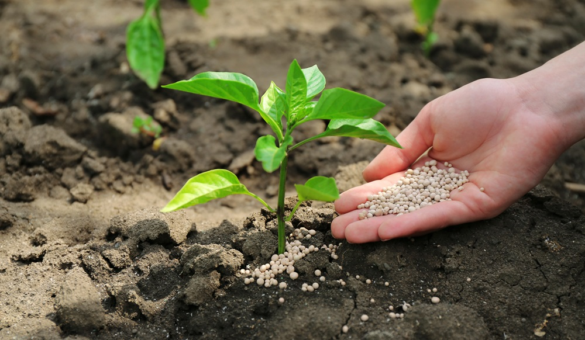

# 🌾 KrishiSahay — Crop & Fertilizer Recommendation System  

An AI-powered web app built with **Streamlit** that recommends the best fertilizer for crops based on soil, weather, and nutrient inputs.  
It also suggests **top 3 alternative fertilizers with cost estimation** and provides **visual insights** to help farmers make smarter decisions.  

---

## ✨ Features  
- 🌱 Predicts the **best fertilizer** for given soil, crop, and weather conditions.  
- 🧪 Considers **Temperature, Humidity, Moisture, Soil Type, Crop Type, N, P, K** inputs.  
- 📊 Displays **Top 3 fertilizer recommendations** with probabilities.  
- 💰 Includes **cost estimation** for fertilizer choices.  
- 📉 Provides **bar chart visualization** for easy comparison.  
- 🌍 Multilingual support (**English + Hindi** toggle).  
- 🎨 Beautiful UI with background image and transparent result cards.  

